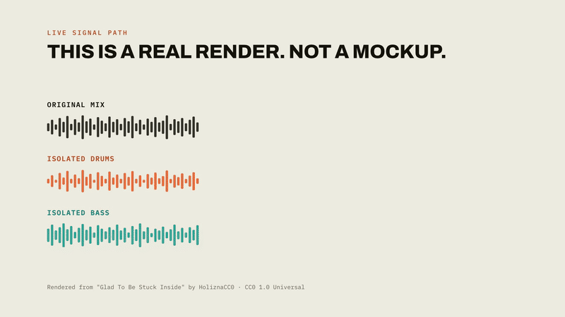

# kitCreator

Turn any song into a playable multi-octave sampler kit. Give it an audio file, tell it what instrument you want, get back an SFZ + DecentSampler preset ready to load in any sampler.



▶ [Watch with sound](https://ethansaba.com/videos/kitcreator.mp4): "Any song becomes a playable kit."
· **[Live demo](https://kitcreator-app.vercel.app/)**

Built by Ethan Saba.

---

## What works right now

**Drums, bass, guitar, piano, and synth are working end-to-end.**

```bash
# Drum kit
kitforge build --song mysong.wav --instrument drums --out ~/Desktop/my_kit

# Bass kit
kitforge build --song mysong.wav --instrument bass --range C1-G4 --out ~/Desktop/bass_kit

# Guitar / piano / synth
kitforge build --song mysong.wav --instrument guitar --out ~/Desktop/guitar_kit
kitforge build --song mysong.wav --instrument piano --range C2-C7 --out ~/Desktop/piano_kit
kitforge build --song mysong.wav --instrument "lead synth" --out ~/Desktop/synth_kit
```

### Drums pipeline

1. **Demucs htdemucs_ft**: separates the song into vocals / drums / bass / other stems
2. **[`--quality high`] DeepFilterNet3**: denoises the drum stem to remove residual bleed before slicing
3. **LarsNet**: splits the drum stem into 5 clean sub-stems: kick, snare, hi-hat, toms, cymbals
4. **Onset detection**: finds every hit in each sub-stem via librosa
5. **Velocity-layered slicing**: sorts hits by pre-normalization energy, bins into up to 4 velocity layers
6. **CLAP round-robin selection**: picks up to 4 timbrally-diverse round-robins per layer via farthest-point sampling on LAION-CLAP embeddings (falls back to energy-spread without internet/weights)
7. **SFZ + DecentSampler export**: hi-hat choke groups, velocity layers (`lovel/hivel`), round-robin sequencing

### Bass / Guitar / Piano / Synth pipeline

1. **BS-RoFormer vocal pre-removal**: `python-audio-separator` with the SOTA `model_bs_roformer_ep_317` checkpoint (17.0 dB instrumental SDR); strips vocals from the mix before htdemucs sees it, so the "other" stem doesn't inherit residual vocal bleed. Runs on Apple Silicon MPS + CoreML, ~3 min/song.
2. **Demucs**: guitar/piano use `htdemucs_6s` (6-stem, dedicated stems); synth uses `htdemucs_ft` "other" stem. Now fed the BS-RoFormer instrumental, not the raw mix.
3. **[`--quality high`] Banquet**: query-conditioned separation. Query is auto-picked as the highest-RMS 10 s window of the rough htdemucs stem (or user-specified via `--query MM:SS-MM:SS`). Banquet runs on the BS-RoFormer instrumental, not the raw mix.
4. **[`--quality high`] DeepFilterNet3**: denoises the (Banquet-refined) stem before transcription
5. **Basic Pitch / torchcrepe**: polyphonic transcription for guitar/piano/synth, monophonic f0 for bass
6. **CLAP canonical selection**: medoid across all occurrences of each MIDI pitch
7. **Voronoi zone fill**: Rubber Band R3 pre-shift for gaps > 6 semitones
8. **ADSR estimation + loop point detection**: RMS-envelope ADSR per zone, autocorrelation-based loop points on sustained samples
9. **SFZ + DecentSampler export**: `pitch_keycenter` per zone, per-region ADSR and loop opcodes

### Output structure

```
my_kit/
├── kit.sfz          # load in Sforzando, sfizz, Bitwig Sampler, etc.
├── kit.dspreset     # load in DecentSampler (free VST/AU/AAX)
└── samples/
    ├── kick_v0_1.wav … kick_v96_4.wav       # drums: vel layer × round-robin
    ├── snare_v0_1.wav … snare_v96_4.wav
    ├── hihat_v0_1.wav … hihat_v96_4.wav
    ├── toms_v0_1.wav  … toms_v96_4.wav
    ├── cymbals_v0_1.wav … cymbals_v96_4.wav
    ├── bass_C2_midi36.wav …                 # bass: one file per zone
    └── bass_E2_midi40.wav …                 # guitar/piano/synth: same scheme
```

Sample filename convention. Drums: `{class}_v{vel_low}_{rr_index}.wav`, pitched: `bass_{note}_{midi}.wav`

### Drum SFZ MIDI layout (GM-adjacent)

| Class   | MIDI note |
|---------|-----------|
| kick    | C1 (36)   |
| snare   | D1 (38)   |
| hihat   | F#1 (42)  |
| toms    | B1 (47)   |
| cymbals | C2 (48)   |

---

## Setup

**Requirements:** Python 3.11, [uv](https://github.com/astral-sh/uv), ffmpeg, rubberband

```bash
# macOS
brew install ffmpeg rubberband

# Install uv
curl -LsSf https://astral.sh/uv/install.sh | sh

# Clone and install
git clone git@github.com:esaba12/kitCreator.git
cd kitCreator
uv venv --python 3.11 .venv
source .venv/bin/activate
uv pip install -e ".[dev]"
```

**LarsNet weights** (562 MB, CC-BY-NC 4.0, local use only):

```bash
gdown "1U8-5924B1ii1cjv9p0MTPzayb00P4qoL" -O ~/.cache/kitforge/larsnet/pretrained_larsnet_models.zip
unzip ~/.cache/kitforge/larsnet/pretrained_larsnet_models.zip -d ~/.cache/kitforge/larsnet/
```

The LarsNet repo is auto-cloned to `~/.cache/kitforge/larsnet/` on first run if weights are present. Without weights the pipeline falls back to a frequency-band energy split (coarser, still works).

---

## Usage

```bash
source .venv/bin/activate

# Drum kit
kitforge build --song song.wav --instrument drums --out ~/Desktop/kit

# Bass kit (default range C1–G4)
kitforge build --song song.wav --instrument bass --out ~/Desktop/bass_kit

# Bass kit with explicit range
kitforge build --song song.wav --instrument bass --range E1-C5 --out ~/Desktop/bass_kit

# Guitar / piano / synth
kitforge build --song song.wav --instrument guitar --out ~/Desktop/guitar_kit
kitforge build --song song.wav --instrument piano --range C2-C7 --out ~/Desktop/piano_kit
kitforge build --song song.wav --instrument "lead synth" --out ~/Desktop/synth_kit

# High-quality mode: Banquet separation + DeepFilterNet denoising + CLAP clustering
kitforge build --song song.wav --instrument piano --quality high --out ~/Desktop/piano_kit

# Pin Banquet's query to a specific 10s window of the song (--quality high only)
kitforge build --song song.wav --instrument synth --quality high --query 0:44-0:54 --out ~/Desktop/synth_kit

# Export the kit to a Roland MC-101 SD card (drums: per-pad WAVs + SETUP.txt; pitched: single root sample)
kitforge build --song song.wav --instrument drums --out ~/Desktop/kit --mc101 /Volumes/MC-101

# Flags
--quality fast|default|high    # fast = htdemucs; default = + BS-RoFormer cascade for pitched; high = + Banquet + DeepFilterNet
--query MM:SS-MM:SS            # (--quality high) override Banquet's auto query window with an exact timestamp
--mc101 <path>                 # also copy the kit to a Roland MC-101 SD card with a SETUP.txt
--debug                        # extra diagnostics and intermediate WAV locations
--config kitforge.toml         # load settings from a TOML file
```

Supported input formats: `.wav`, `.mp3`, `.flac`, `.aiff`, `.aif`, `.m4a`, `.ogg`

**Stem cache:** Demucs results are cached at `~/.cache/kitforge/stems/<songname>/` keyed by file SHA-256. Re-running the same file skips separation entirely.

**Stage cache:** Slicing and packaging results are cached in `~/.cache/kitforge/stage_cache/` keyed by `(file_hash, stage_version, params, output_dir)`. Second run on the same song+output is near-instant.

**Example output (drums, cached run):**
```
Stage 1/3: Stems cached, skipping separation
  separation: 0.0s
Stage 2/3: Extracting samples...
  extraction: 12.2s, 80 one-shots
Stage 3/3: Writing SFZ and DecentSampler preset...
  packaging: 0.0s

Done in 12.3s, 80 samples
  SFZ           ~/Desktop/kit/kit.sfz
  DecentSampler ~/Desktop/kit/kit.dspreset
  Samples dir   ~/Desktop/kit/samples
```

---

## Architecture

Three pipelines share a common spine: **separate → transcribe → extract → package**.
Drums branch at sub-stem separation and slice by velocity; pitched instruments branch at
f0/polyphonic transcription and fill zones per MIDI note.

```
song.wav → [BS-RoFormer] → demucs → [LarsNet | crepe | Basic Pitch]
         → slice → CLAP select → [pitch-shift, ADSR, loop points]
         → kit.sfz + kit.dspreset  (+ optional MC-101 SD card export)
```

Full stage-by-stage data flow and the status of every module are in
[`docs/module-map.md`](docs/module-map.md); the per-instrument spec is in
[`docs/pipeline-spec.md`](docs/pipeline-spec.md).

## Notable decisions

**Strip the vocals before the separator that isn't good at vocals.** htdemucs isolates
vocals at ~10.5 dB, so vocal bleed lands in the "other" stem, exactly the stem guitar and
synth kits are built from. Running BS-RoFormer (17 dB) first makes "other" a true
non-vocal residual. It costs ~3 min/song, and stems are cached by content hash so it runs
once per song, not once per build.

**Pick the canonical sample by timbre, not by length.** The obvious heuristic, keeping the
longest occurrence of each note, reliably picks loud, dirty hits. Taking the CLAP-embedding
medoid across every occurrence instead picks the one that's most perceptually
representative, which is what a sampler actually wants.

**Round-robins use farthest-point sampling, not clustering.** HDBSCAN degenerates on the
5–20 hits per velocity bucket that a real song provides. Farthest-point sampling on CLAP
embeddings directly maximizes pairwise distance, which is the actual goal.

**Sort velocity layers before normalizing, not after.** Normalization makes every peak
uniform, so sorting afterward yields arbitrary layers. The raw pre-normalization energy is
the only thing that carries the dynamics.

**The cache key includes the output directory.** Cached `OneShot` objects hold absolute
sample paths, so a cache hit from a different `--out` produces an SFZ pointing at files
that aren't there. Subtle, and only reproducible on a second run with different arguments.

**Ship SFZ and DecentSampler together.** SFZ is the open standard but needs a host;
DecentSampler is a free VST/AU that makes the kit playable immediately. Writing both costs
one extra writer module and removes the "now install a sampler" step.

The full log (every non-obvious choice, with the bug that motivated it) is in
[`docs/decisions.md`](docs/decisions.md).

## Known issues

- **LarsNet weights are CC-BY-NC 4.0**: fine for personal use, not for redistribution.
- **808-heavy tracks** produce 1–2 unique bass pitches, because 808 sub-bass is often a
  single root note. Use `--range C1-G4` or lower.
- **f0 tracking is capped at 90 s** to avoid OOM, so pitches appearing only late in a song
  are missed.
- **Banquet takes ~15–35 min/song on CPU**: it's `--quality high` only, and not needed
  for a good kit.

Eleven more, with workarounds, in [`docs/known-issues.md`](docs/known-issues.md).

## Roadmap

**`--quality high`** adds Banquet query-conditioned separation (pitched), DeepFilterNet3
denoising, and CLAP-based round-robins. One-time setup:

```bash
kitforge setup-banquet    # ~30 MB repo + ~645 MB weights
kitforge build --song song.wav --instrument piano --quality high --out ~/Desktop/piano_kit
```

`default` and `fast` never load those models.

**Phase 2: DAC-token language model.** A ~100M-param decoder-only transformer over DAC
tokens, conditioned on pitch, velocity, and CLAP timbre embedding, to replace DSP pitch
shifting for large intervals. Scaffolding in `synth/dac_lm.py`.

## Documentation

| Doc | What's in it |
|---|---|
| [Pipeline spec](docs/pipeline-spec.md) | Stage-by-stage spec for each instrument |
| [Module map](docs/module-map.md) | Every module, its status, and the full data flow |
| [Decisions](docs/decisions.md) | Why things are the way they are |
| [Known issues](docs/known-issues.md) | Gotchas and workarounds |
| [Architecture report](docs/architecture-report.md) | The build report this project started from: prior-art survey, why the orchestration layer is the novel part, and the two-layer plan |
